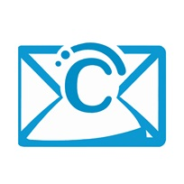

# Dovecot Certificate Interface (DCI)

## Introduction

DCI is a software tool designed to enable and manage per-domain SSL certificates for Dovecot, seamlessly integrating with ISPConfig. This interface offers automation, user management, logging, and other features to simplify the administration of secure email services.

## Features

- **Per-Domain SSL Certificate Management**: Automates the configuration of SSL certificates for individual domains in Dovecot.
- **SSL Validation**: Before adding domains to Dovecot, DCI conducts deep validation checks on SSL certificates to ensure proper configuration.
- **ISPConfig Integration**: Fetches and applies SSL certificates automatically from ISPConfig, including Let's Encrypt certificates.
- **User Management**: Manage users with different permissions; supports password recovery through database manipulation.
- **Logging & Monitoring**: View and monitor cronjob activities and other background processes directly through the web interface.
- **Debugging Support**: Enable MySQL logging for detailed error tracking during development.
- **IP Blacklisting**: Automatic IP blocking after failed login attempts, with an option to unblock manually.
- **User Management**: DCI includes user management, allowing administrators to create, edit, or delete users and assign different permissions. If the administrator password is lost, recovery requires direct database manipulation.
- **Standalone Mode**: Can be used independently of other hosting software, though manual Dovecot configuration is required.
- **Logging**: DCI provides logging for cronjob activities and includes a debugging mode that can be enabled in `settings.php` to log MySQL errors.

## Documentation
This framework is documented inside the files you can find in the "docs" folder. Just open the index.html with your web browser and you can navigate through the documentation of every class and function.

You can also find the documentation at: 
https://bugfishtm.github.io/Dovecot-Certificate-Interface/

## Requirements

- Mailserver with Dovecot
- No other software managing per-domain SSL certificates
- PHP8-capable web server
- MySQL database

## Example Images

## System File Modifications

DCI operates non-destructively, meaning it does not alter active configuration files. Instead, it generates a configuration file defined by the `_CRON_DOVECOT_FILE_` constant in `settings.php`. The only manual change required is adding a single string to `dovecot.conf`, which can be easily reverted. The software validates certificates deeply, minimizing the risk of corrupting Dovecot configurations. However, ensure it is not used alongside other hosting software like Plesk or Virtualmin, which might conflict with its operations.

## Default Login for Web Interface

- **Username:** admin  
- **Password:** changeme

## Support & Assistance

For support, visit [bugfish.eu/forum](https://www.bugfish.eu/forum) or contact us at [request@bugfish.eu](mailto:request@bugfish.eu).

## Powered by Bugfish Framework

## License Information

Refer to the `license.md` file in the repository for licensing details and compliance requirements.

🐟 Bugfish <3