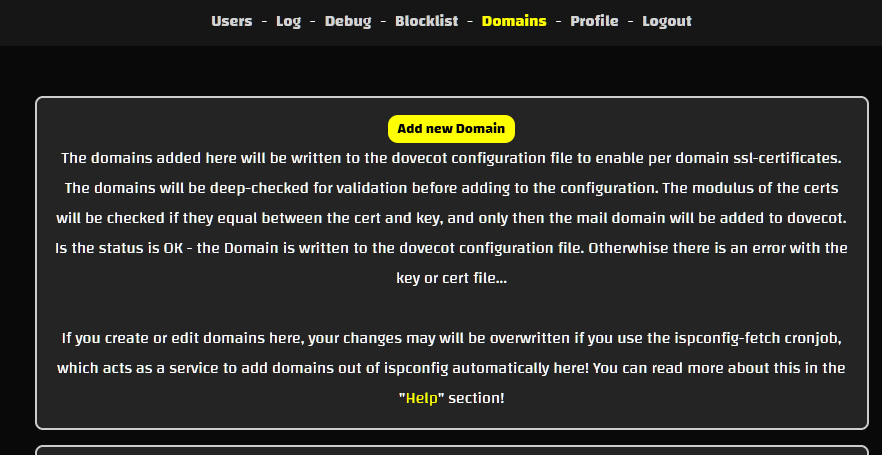

# Dovecot Certificate Interface (DCI)

Effortless per-domain SSL management for Dovecot with ISPConfig integration.

-----------

## Introduction

Welcome to the documentation for the Dovecot Certificate Interface [DCI]! This software facilitates the management of Dovecot per-domain SSL certificates and is designed to work seamlessly with ISPConfig. It provides a streamlined approach to configuring Dovecot for secure email communications across multiple domains.

**Key Features:**
- Manage and control Dovecot per-domain SSL certificates.
- Automate the ISPConfig Dovecot configuration file generation.
- Integrate with existing systems with minimal impact.

**Important:** If another system is already managing Dovecot configuration files (e.g., Plesk), using this software may lead to conflicts.

The Dovecot Certificate Interface allows for:
- SSL certificates for each domain used with Dovecot.
- Automation of certificate configuration with ISPConfig.
- Deep validation of certificates to ensure their integrity.

**Note:** This software has been tested primarily on Debian and Ubuntu systems. Compatibility with other systems should be verified individually.

### Requirements

See Installation section of this documentation.

### Compatibility

The software has been tested on various systems:

- **Debian:** 8/9/10/11
- **Ubuntu:** 16/18/20/22
- **Dovecot Versions:** Various (Standalone)
- **ISPConfig Versions:** Various (Auto-Fetch Domains and SSL Certificates)

### System Files Changes

The DCI software is non-destructive:

- It modifies only the file specified in `settings.php` with the constant `_CRON_DOVECOT_FILE_`.
- Additions to the `dovecot.conf` file are reversible.
- Conflicts with other configuration management tools (e.g., Plesk) should be avoided.

### User Management

Manage users with the following capabilities:

- Create, edit, and delete users.
- Assign different permissions for various areas.
- If the admin password is lost and no other users have access, you must either delete the user database from MySQL or change the admin password directly in the database.

### Logging

Monitor the background operations of cronjobs in the "Logs" section of the web interface:

- View logs for `sync.php` and `ispconfig-fetch.php`.
- Latest entries are the most relevant, with older entries available in the archive.

### Debugging

Enable MySQL logging for debugging purposes by setting `_MYSQL_LOGGING_` to "true" in `settings.php`. This will display MySQL errors in a new section of the web interface. This feature is intended for debugging and not for use in production environments.

### SSL Validation

Domains added to the software will be validated before being written to the Dovecot configuration file:

- **Validation Checks:** The software checks certificate modulus to ensure consistency between certificate and key.
- **Error Handling:** Domains with invalid certificates or keys will not be added.

### Use with ISPConfig

- **Automation:** The software can automatically create Dovecot configuration files for SSL mail domains by fetching certificates from ISPConfig.
- **Custom Certificates:** If custom ISPConfig certificates are available, they will be used.
- **Standalone Mode:** If using ISPConfig, avoid activating the `ispconfig-fetch` cronjob if you want to manage domains manually.

### IP Blacklisting

The software includes an IP blacklisting feature:

- **Failed Logins:** IP addresses are blocked after a specified number of failed login attempts.
- **Blocking Duration:** IPs remain blocked until the `daily.php` cronjob is executed or manually removed.

-----------

## Screenshots  
Check out our [Screenshots Gallery](./screenshots.html) for a visual overview of the project. You’ll find images showcasing key features and user interface design, offering a preview of what to expect.

-----------

## Tutorials  
Visit the [Tutorials Page](./tutorials.html) for a collection of step-by-step guides that will help you get the most out of the project. These tutorials cover everything from installation to advanced functionality.

-----------

## Downloads  
The [Downloads Section](./download.html) provides all the necessary files to get started with the project, including the latest software versions and any related resources.

-----------

## Installation  
Follow the clear and detailed instructions in our [Installation Guide](./installation.html) to set up the project. This guide will help you get everything running smoothly on your system.

-----------

## Contributing  
Find out how you can contribute to the project by visiting the [Contributing Page](./contributing.html). Whether you want to report bugs, suggest features, or submit improvements, we welcome your involvement.

-----------

## Warranty  
Review the terms of our warranty on the [Warranty Information Page](./warranty.html). This page outlines the scope of support and any applicable guarantees.

-----------

## Support  
If you need assistance, visit the [Support Page](./support.html) to find the available channels for getting help with any issues or questions you might have.

-----------

## License  
Get the full details on licensing by checking out the [License Information Page](./license.html). This section includes the terms and conditions under which the project is distributed.